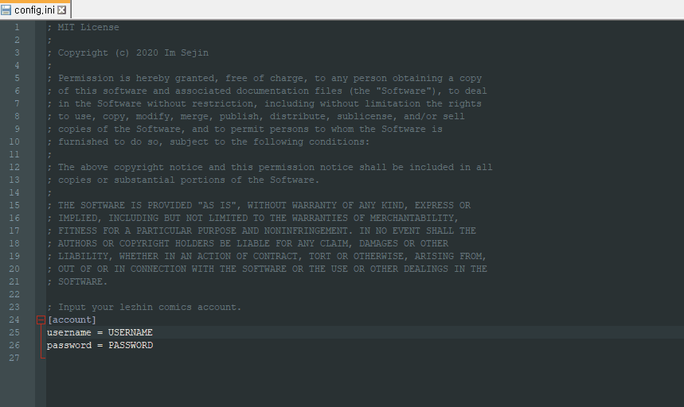

<p align="center">
    
</p>

<h1 align="center">Lezhin Comics Downloader</h1>

<p align="center">Downloader for lezhin comics</p>

<p align="center">
    <a href="https://lgtm.com/projects/g/ImSejin/lezhin-comics-downloader/context:java"></a>
    <a href="https://frontend.code-inspector.com/project/16360/dashboard"></a>
    
</p>

<p align="center">
    
    
    
    
</p>

# Preview



<p align="center">This is downloader that helps you to login and downloads the specified comic for all lezhin-comics even adults.</p>
<p align="center">※ <i>The user is responsible for everything that happens using this program.</i></p>
<br><br>

# Getting started

## Pre-requirements

1. Check if chrome browser was installed in your device or download it [here](https://www.google.com/chrome).

2. Check your <ins>chrome browser version</ins> with this URI `chrome://version`.

   (The first line is the version. e.g. 83.0.4103.116)

3. Download the `chrome driver` that matches <ins>its version</ins> and your device OS [here](https://chromedriver.chromium.org/downloads) and decompress it.

4. Check if JRE(or JDK) version is greater than or equal to 8 or install it.

5. Download the latest released `lezhin-comics-downloader.jar` [here](https://github.com/ImSejin/lezhin-comics-downloader/releases).

6. Download `config.ini` [here](https://raw.githubusercontent.com/ImSejin/lezhin-comics-downloader/master/config.ini) and write your account in the file.

7. Place three files in the same path.

8. Use the following command to run the downloader.

<br><br>

## Usage

```cmd
java -jar {JAR filename} -l=<language> -n=<comic name> [-r=<episode range> -d]
```

- *<ins>language</ins> (required)*: language of lezhin platform you want to see.
  
  - **ko** : korean
  - **en** : english
  - **ja** : japanese
  
- *<ins>comic name</ins> (required)*: webtoon name you want to download.

<p>
    
</p>

- *<ins>episode range</ins> (optional)*: range of episodes you want to download.
  - __skipped__ : all episodes
  - __n~__ : from ep.N to the last episode
  - __~n__ : from the first episode to ep.N
  - __m~n__ : from ep.M to ep.N
- <ins>debug</ins> (optional): enables debugging mode.

<br><br>

# Examples

```cmd
java -jar lezhin-comics-downloader.jar -l=en -n=appetite
```

Downloads all episodes of the comic named appetite.

<br>

```cmd
java -jar lezhin-comics-downloader.jar -l=en -n=appetite -r=8~
```

Downloads the episodes of the comic named appetite from ep.8 to the last.

<br>

```cmd
java -jar lezhin-comics-downloader.jar -l=en -n=appetite -r=~25
```

Downloads the episodes of the comic named appetite from the first to ep.25.

<br>

```cmd
java -jar lezhin-comics-downloader.jar -l=en -n=appetite -r=1~10
```

Downloads the episodes of the comic named appetite from ep.1 to ep.10.

